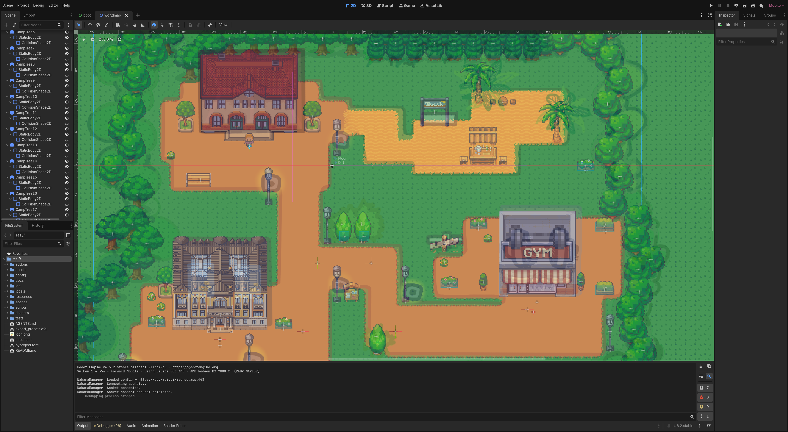
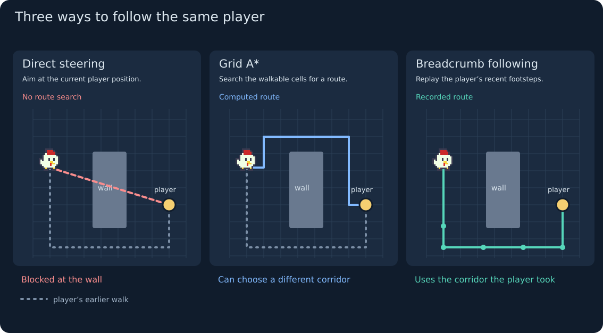

+++
title = "How I Polished Pixiverse: Picky the Chicken"
description = "Implementing a robust path-following algorithm for a companion follower"
date = "2026-09-30"
[taxonomies]
categories = ["Write-up"]
tags = ["Godot", "Optimization"]
+++

Pixiverse is a Godot engine game I've worked with [0xkata](https://0xkata.github.io/) to develop over the last few months.
It is effectively a productivity tracker: the player put tasks they need to do in real life, such as going to the gym or doing an assignment, and then complete the task along with their in-game character.
There is a multiplayer element as well, everyone can see what other online players are currently doing in real time, and seeing others focusing can help one really lock in to their own work.

In our first playtests, multiplayer hasn't been fully implemented yet. As I walked around the barren map with some NPCs standing around, I thought that, wouldn't it make sense to have a companion that follows you around?
After all, this is pretty commonly done in actual JRPGs for the same reasoning, the game would feel a lot more repetitive otherwise.
So we designed Picky, a funny chicken that follows you around and is there to witness your progress.

## Basic pathfinding algorithms

Picky is based on a `CharacterBody2D`.
To make Picky follow the player, it will need to find a path to the player that avoids any obstacles, and make a movement along that path every physics tick.

The well-known A* search is the most common and efficient search based on a heuristic that guarantees optimality on a 2D coordinate grid.
So if we have the location of Picky and the player, we can use A* to compute the path that Picky follows, and take a step in the path.

But just using A* naively is inefficient, as we would be doing a lot of duplicate work across multiple ticks.
We are also only taking a small part of the path, wasting the rest of the path that gets thrown out.

An idea of optimization is: save the path so it doesn't need to be recomputed again the following tick.
We can reuse the same path given that the player has not substantially moved from the target, and if the player has moved we can extend the end of the path to the new target player position.
And if we can bear with a small increase in follow retargeting latency, we can run the algorithm asynchronously say every 0.25 seconds, distributing the cost over multiple frames.

This led to my first Picky NPC implementation, which the object computs its own path on a grid built from the room's tilemap.
More technically, the NPC constructs an `AStarGrid2D` with a common Manhattan distance heuristic.
For every cell in the region, we ran `PhysicsShapeQueryParameters2D` `intersect_shape`, a rectangle about 62% of a tile, and marked the cell solid if it hit any static collider that was an obstacle.
The goal is to follow slightly behind the player's position plus velocity vector, and stops once it was within a fixed follow distance of that point.

Every 0.25s, a change of target cell, or a stuck detector (based on near-zero movement) calls a repath.
This converts the cell path back into world waypoints, for which Picky moves towards at a fixed speed.

Some additional polish includes making Picky stop as soon as the player stops, snap the chicken to a 1 px grid, and ensure the chicken has y-sort set up correctly.

This implement is nice, but again has some issues.

First, every cell in the region has to run an `intersect_shape`, so we have **O(cells)** physics queries on each path build.
And, anything that changed walkability at runtime, most commonly a door, does not update the grid so the chicken could path into a now-solid cell.
Also, walkability by our definition came from the tilemap and from physics probes, and "reconciling" them was a source of fiddly edge cases.

So the targeting logic (trailing behind the player's velocity) and the stuck-recovery logic were sound, but these issues along make the follow feel somewhat sluggish.

## Enhancements to pathfinding: breadcrumb trail

As a result, I dropped the tilemap A* pathfinding in favor of a simpler breadcrumb behavior.
This includes the whole route-computation half of the A*, including the grid, physics probes, cell search, the world-to-cell conversion, and the repath timer.
Now, Picky simply copies the player's previous movements.

The way it works is, we have a FIFO queue containing the last several locations of the player.
As the player moves, append their position to a trail queue.
Once Picky is within say 2 px of the oldest trail point, pop that point.
Picky then moves toward the next trail point, or the follow-target if the queue is empty.
If Picky is stuck, we can just clear the queue and have Picky path back to the player by directly.

This is overall a better fit because the route the player walked provides a viable path already, and is also more natural as it makes sense for a following companion to not constantly try to take the shortest path to the player.
Note that the connecting segments are still an approximation, Picky can cut corners, and the queue length limit (currently 6) can discard a turn before Picky reaches it.
Picky still relies on collision handling and stuck recovery, though is better than before as the chance of walking into an obstacle is reduced.

Another major improvement is when walking through a narrowing door, Picky follows the exact gap the player just squeezed through, rather than independently choosing a grid route through the gap.
There's also no grid data structure to rebuild, so nothing goes stale, and the stuck-recovery is simpler.

## Ownership model

Now after I have a good implementation of the follow algorithm, I moved the core pathing logic into a dedicated persistent `ChickenFollowerManager`, which owns the Picky object.

This separates the responsibility of the Picky object into two main roles.
Picky in-game `CharacterBody2D` object owns only transient movement state: the trail, the stuck timer, and the last position.
The manager `ChickenFollowerManager` is the only creator/destroyer of the follower and the only public API surface. 
External systems directly call this to interact with Picky.

This has actual benefits for various game logic, including the onboarding sequence which became less error prone with the persistent manager, and it is more robust with the teleportation feature and multiplayer stability.

## Summary

I originally implemented a constantly updating A* search algorithm for Picky, like an RTS unit that is constantly being managed.
But it turns out this is overcomplicating things, and the simpler breadcrumb approach was overall more efficient, less likely to get stuck, and walks a more natural path to the player.
This really demonstrates that in software engineering, we often tend to look first at a more general solution (i.e. A*, depending on a large framework, etc.), where a simpler solution specialized to the current problem at hand is the better approach.
